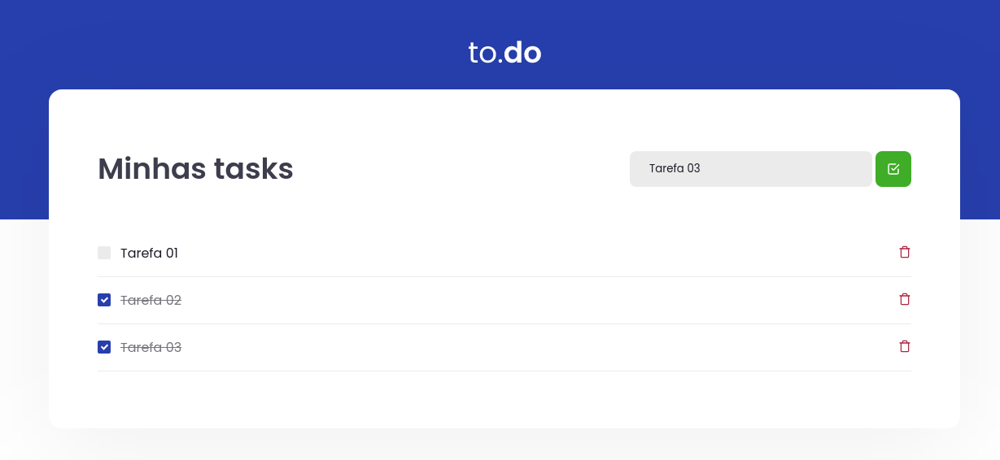

<h1 align="center">
    
</h1>

<h1 align="center">
			Desafio 01 - Conceitos do React
</h1>

<h3 align="center">
    Desafio 01 proposto para testar os conhecimentos adquiridos no módulo de <strong>Fundamentos do ReactJS</strong> do Ignite na Trilha de React.
</h3>

---

## 💻 Sobre o projeto

Esse projeto é uma pequena aplicação de atividades a fazer (To Do), para treinar um pouco mais sobre manipulação do estado no React.

Funcionalidades
- 🗒 Adicionar uma nova tarefa
- ❌ Remover uma tarefa
- ✅ Marcar e desmarcar uma tarefa como concluída 

---

## 👀 Demo

<div align="center">
    
</div>

---

## 🚀 Tecnologias utilizadas

Esse projeto foi desenvolvido utilizando as seguintes tecnologias:

- [React](https://reactjs.org)
- [TypeScript](https://www.typescriptlang.org/)
- [Babel](https://babeljs.io/)
- [Webpack](https://webpack.js.org/)
- [Sass](https://sass-lang.com/)

---

## 🛠 Como executar o projeto em sua máquina

```bash

# Clone este repositório
$ git clone https://github.com/paulomvrech/desafio01-trilha-reactJS.git

# Acesse a pasta do projeto no seu terminal/cmd
$ cd desafio01-trilha-reactJS

# Instale as dependências
$ npm install ou yarn install

# Execute a aplicação em modo de desenvolvimento
$ npm run dev ou yarn dev

# A aplicação será aberta na porta:8080 - acesse http://localhost:8080
```

---

<p align="center">Desenvolvido por 👏 Paulo Muller Vrech</p>